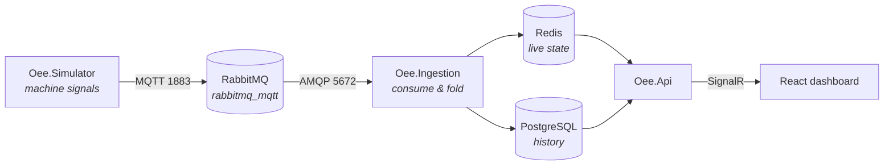

# LineCore

Real-time OEE and production monitoring for a manufacturing line, built end to end:
machine signals in over MQTT, live state in Redis, history in PostgreSQL, and a dashboard
that updates as the line runs.

There is no real hardware behind it. A simulator in this repo generates the signals,
including the failures — the point is the pipeline and the production maths, not the PLC.

---

## Why this project

OEE is easy to define and easy to get wrong. Most implementations compute
`Availability × Performance × Quality`, put a number on a screen, and stop there — which
tells an operator that they lost time without telling them where it went.

LineCore takes the harder version seriously:

- **Losses are attributed from reason codes, not guessed from durations.** Every stop
  carries the code the operator selected, and each code maps to one of the Six Big Losses.
  Inferring the category from how long a stop lasted is a guess; reading it off the reason
  is a fact.
- **Bad data is surfaced, not swallowed.** A window where the counts imply the machine beat
  its own ideal cycle time is a configuration error. The calculator reports the raw value
  and flags it rather than clamping it into looking fine.
- **Degenerate inputs never produce `NaN`.** A zero denominator yields a zero factor and a
  flag, because a dashboard reading "0% — no planned time" is useful and one reading `NaN`
  is not.

---

## Architecture



RabbitMQ's MQTT plugin is what joins the two halves: the simulator publishes to MQTT
topics, the plugin republishes them into `amq.topic`, and the ingestion service consumes
them as ordinary AMQP messages. One broker, two protocols, no bridge to maintain.

---

## The OEE model

`Oee.Domain` is pure — no clock, no I/O, no configuration — so every interesting case is
pinned down by a test rather than argued about.

### The calculation

```
PlannedProductionTime = ShiftLength            - PlannedDowntime
RunTime               = PlannedProductionTime  - UnplannedDowntime

Availability          = RunTime / PlannedProductionTime
Performance           = (IdealCycleTime × TotalCount) / RunTime
Quality               = GoodCount / TotalCount
OEE                   = Availability × Performance × Quality
```

The three factors telescope, so `OEE = FullyProductiveTime / PlannedProductionTime` — an
identity worth asserting, because it is the first thing to break if a denominator is wrong.

### The locked reference case

| Input | Value | | Output | Value |
| --- | --- | --- | --- | --- |
| Shift length | 480 min | | Availability | **88.8%** |
| Planned downtime | 60 min | | Performance | **86.1%** |
| Unplanned downtime | 47 min | | Quality | **97.8%** |
| Ideal cycle time | 1.0 s | | **OEE** | **74.8%** |
| Total / rejects | 19,271 / 423 | | | |

### The Six Big Losses

Attribution comes from `ReasonCode.SixBigLossCategory`. A reason code is either planned —
subtracted before OEE is calculated, and therefore not one of the losses OEE explains — or
unplanned and categorised. Never both, and never neither: a database check constraint
enforces it, because an uncategorised stop would silently vanish from the Pareto chart.

| # | Loss | Factor |
| - | --- | --- |
| 1 | Breakdowns | Availability |
| 2 | Setup and adjustments | Availability |
| 3 | Idling and minor stops | Performance |
| 4 | Reduced speed | Performance |
| 5 | Process defects | Quality |
| 6 | Startup rejects | Quality |

### Data quality

`OeeResult.DataQuality` is a flags enum. None of these throw — they describe data that is
wrong or degenerate but still calculable.

| Flag | Meaning |
| --- | --- |
| `NoPlannedTime` | The shift was entirely planned downtime |
| `NoProduction` | Nothing came off the machine |
| `NoRunTime` | Downtime consumed all of Planned Production Time |
| `PerformanceExceedsIdeal` | `Performance > 1` — the ideal cycle time is set too slow |
| `DowntimeExceedsPlanned` | Run Time would have been negative; clamped to zero |

`Performance` is reported **raw and uncapped**. A value above 1 is impossible in reality,
so the excess measures exactly how wrong the ideal cycle time is — clamping would throw
that away and leave a broken configuration looking like a perfect machine. Clamp at the
presentation layer if you need a display value, and read the flag to know when you did.

### Shifts

Shifts are stored as a start time plus a wall-clock duration, not an end time, so a night
shift running 22:00–06:00 stays a single row. `ShiftDate` is the local date the shift
*started*, which keeps a night shift as one reporting unit instead of splitting it at
midnight.

`ShiftAssignment.ActualLength` is computed from the resolved UTC bounds rather than echoing
the nominal duration: a shift spanning a daylight-saving transition is genuinely 7 or 9
hours long, and that real length is what must feed `OeeInput.ShiftLength`. Using the
nominal 8 hours would misstate Availability twice a year.

---

## Getting started

Requires the .NET 9 SDK and Docker.

```bash
cp .env.example .env
```

Bring up Postgres, RabbitMQ and Redis:

```bash
docker compose up --detach --wait
```

Apply migrations and seed the master data:

```bash
dotnet tool restore && dotnet ef database update --project src/Oee.Persistence
```

Build and test:

```bash
dotnet test LineCore.sln
```

| Service | URL / port |
| --- | --- |
| PostgreSQL | `localhost:5432` |
| RabbitMQ (AMQP) | `localhost:5672` |
| RabbitMQ (MQTT) | `localhost:1883` |
| RabbitMQ (console) | <http://localhost:15672> — `linecore`/`linecore` |
| Redis | `localhost:6379` |

Tear down, including volumes:

```bash
docker compose down --volumes
```

---

## Seeded master data

One plant (`IST-01`, `Europe/Istanbul`), two lines, six machines, four products, three
shifts, twelve reason codes, and one meal break per shift.

> **Known gap:** the three shifts are attached to `LINE-A` only, so `LINE-B` currently has
> no schedule and its machines cannot resolve to a shift. Either add three more shift rows
> for `LINE-B` or move `Shift` up to the plant with per-line overrides. Needs deciding
> before Phase 3 folds signals into shift buckets.

---

## Layout

```
src/
  Oee.Domain/            OEE maths, shift resolution, entities. Depends on nothing.
  Oee.Persistence/       DbContext, configurations, migrations, seed.
tests/
  Oee.Domain.Tests/      Reference case, edge cases, DST behaviour.
  Oee.Persistence.Tests/ Seed invariants, asserted against the model with no database.
infra/
  rabbitmq/              Broker config, including the MQTT listener.
```

---

## Roadmap

| Phase | Scope | Status |
| --- | --- | --- |
| 0 | Repo scaffolding, docker-compose infrastructure, CI | ✅ |
| 1 | Domain model, pure OEE calculator, shift resolver, EF Core + seed | ✅ |
| 2 | `Oee.Simulator` — machine model, failure injection, MQTT publish | ⬜ |
| 3 | `Oee.Ingestion` — AMQP consumer, state folding, Redis live state | ⬜ |
| 4 | Downtime events, shift aggregation, loss Pareto | ⬜ |
| 5 | `Oee.Api` — REST endpoints and SignalR push | ⬜ |
| 6 | React + TypeScript + Vite dashboard | ⬜ |

Deferred: TEEP and the utilization factor, and per-*(product, machine)* ideal cycle times.
Both are small additions once there is real data to justify them.

### Out of scope, deliberately

Real PLC/OPC-UA integration, multi-tenancy, Kubernetes, microservice decomposition,
event sourcing, CQRS frameworks, mediator libraries.

---

## Conventions

- Nullable reference types on, warnings as errors, analyzers at `latest-recommended`.
  Scaffolded migrations are exempted via a scoped `.editorconfig`, nothing else is.
- Central package management via `Directory.Packages.props`.
- `Oee.Domain` takes no dependencies — everything else may depend on it.
- Database identifiers are snake_case, applied by a model-wide convention rather than by
  hand, so nothing needs quoting in psql.
- Tests are named as sentences; the test report should read like documentation.
